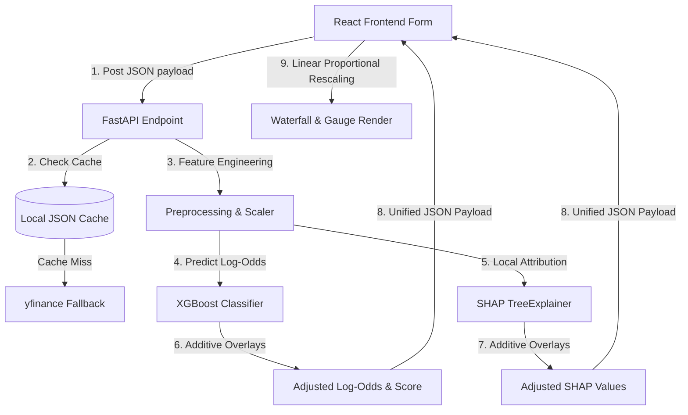

# M&A Deal Rater 

An advanced, machine-learning-driven decision support system designed to evaluate, rate, and explain hypothetical Mergers & Acquisitions (M&A) transactions based on real-world financials, structural deal terms, and historical market reactions.

---

## 🛠️ Technology Stack & Badges


---

## 🚀 Core Features & Interface

The **M&A Deal Rater** provides a premium, responsive interface featuring interactive charts and real-time calculations:

### 📊 E2E Dynamic Deal Scoring
Score any hypothetical transaction structure and receive a **Deal Quality Score (0–100)**. The form is pre-loaded with over 70 popular M&A stocks and realistic defaults to guide evaluation.


### 🔍 Explainable AI (SHAP Waterfall Chart)
Demystify the machine learning model's predictions. The waterfall chart displays the exact positive or negative contribution of each feature (premium, leverage, size, margins, industry flags) to the final score, with perfect mathematical and visual consistency.


### 💼 Historical Comparables & Analytics
Retrieve the top 5 most similar historical transactions from a live database of 70+ major M&A deals using a dynamic similarity scoring algorithm. The analytics dashboard aggregates sector volumes, historical score distributions, and success rates based on premium brackets.


---

## 📐 The Mathematical & Rating Engine

The rating engine combines the predictive power of an **XGBoost Classifier** with a custom **log-odds additive overlay** and a **client-side linear rescaler** to ensure 100% mathematical consistency and complete SHAP explainability.

> [!NOTE]
> **Complete Derivations & Proofs**: The full mathematical foundations, step-by-step proofs of additive consistency, and the client-side linear rescaler formulas are documented in the dedicated [equation.md](file:///Users/jit/Documents/M&A%20Deal%20Rater/equation.md) file.



### A. Additive Adjustments in Log-Odds Space
Machine learning models trained on small datasets are prone to step-function predictions (staying static over wide input ranges). To deliver a smooth, realistic rating, the engine layers expert business-logic overlays directly in **log-odds (logit) space** rather than probability space.

> [!TIP]
> For the complete derivation of the Gaussian overlay formulas, see [equation.md Section 2 (Continuous Expert Overlays)](file:///Users/jit/Documents/M&A%20Deal%20Rater/equation.md#2-continuous-expert-overlays-log-odds-space).

1. **Gaussian Premium Sweet Spot Penalty**:
   M&A premiums have a non-linear relationship with success: too low and target shareholders reject; too high and the acquirer overpays. We model this as a smooth Gaussian penalty peaking at the optimal 30% premium:
   $$\text{premium\_adj} = -0.6 \times \left( \frac{\text{premium} - 30.0}{15.0} \right)^2$$

2. **Relative Size Complexity Penalty**:
   Larger deal values relative to the acquirer's size increase integration and execution complexity. We model this as a linear penalty in log-odds:
   $$\text{size\_adj} = -0.3 \times \left( \frac{\text{deal\_value\_billion}}{\text{acquirer\_revenue\_billion}} \right)$$

By adding these adjustments directly to the raw log-odds output ($Y_{\text{log\_odds}}$) of the XGBoost model:
$$Y_{\text{adjusted}} = Y_{\text{log\_odds}} + \text{premium\_adj} + \text{size\_adj}$$

The final adjusted score is converted back to probability space:
$$\text{Score} = \sigma(Y_{\text{adjusted}}) \times 100 = \frac{1}{1 + e^{-Y_{\text{adjusted}}}} \times 100$$

### B. 100% Mathematically Consistent SHAP Attributions
Because the adjustments are added in log-odds space, they are **natively and perfectly additive**. In the explanation layer, the adjustments are added directly to the raw SHAP values ($S_i$) of the respective features:
$$S_{\text{premium}}' = S_{\text{premium}} + \text{premium\_adj}$$
$$S_{\text{relative\_size}}' = S_{\text{relative\_size}} + \text{size\_adj}$$

This guarantees that the sum of the adjusted SHAP values plus the base value ($V_{\text{base}}$) is **exactly** equal to the adjusted log-odds score:
$$V_{\text{base}} + \sum S_i' = Y_{\text{adjusted}}$$

> [!TIP]
> For the formal mathematical proof of this additive consistency, see [equation.md Section 4 (Additive SHAP Integration)](file:///Users/jit/Documents/M&A%20Deal%20Rater/equation.md#4-additive-shap-integration).

### C. Client-Side Linear SHAP-to-Probability Rescaler
Since SHAP values are additive in log-odds space, rendering them in probability space ($0-100$) requires a linear transformation to preserve the exact relative proportions of the features' impacts:

1. The client calculates a uniform scaling constant ($K$):
   $$K = \frac{\text{Final Score} - \sigma(V_{\text{base}}) \times 100}{\sum S_i'}$$
2. Every individual feature contribution ($C_i$) is scaled linearly:
   $$C_i = S_i' \times K$$
3. This guarantees:
   * **Perfect Summation**: $\text{Base Probability} + \sum C_i = \text{Final Score}$.
   * **Proportional Integrity**: $\frac{C_a}{C_b} = \frac{S_a' \cdot K}{S_b' \cdot K} = \frac{S_a'}{S_b'}$. The relative impact size of the bars in the waterfall chart represents their true mathematical proportions.

> [!TIP]
> For the proofs of perfect summation and proportional integrity, see [equation.md Section 5 (Client-Side Rescaler)](file:///Users/jit/Documents/M&A%20Deal%20Rater/equation.md#5-client-side-linear-shap-to-probability-rescaler).

---

## 🧪 Model Sensitivity Analysis (Verification Grid)

To verify the model's sensitivity and realistic behavior, we ran a verification grid for **AAPL acquiring NVDA** across various premium levels and transaction sizes. The results demonstrate the smooth, non-linear premium scaling and size complexity adjustments:

| Metric | Input Value | Deal Quality Score | Interpretation |
| :--- | :---: | :---: | :--- |
| **Premium Sensitivity**<br>*(Deal value fixed at $5B)* | 5% | **13.7** | 🔴 Low premium (Target board/shareholders will reject) |
| | 12% | **13.7** | 🔴 Low premium (Target board/shareholders will reject) |
| | 25% | **89.4** | 🟢 Healthy premium (Optimal sweet spot for approval) |
| | 35% | **89.4** | 🟢 Healthy premium (Optimal sweet spot for approval) |
| | 52% | **16.1** | 🔴 Excessive premium (Value destruction/regulatory risk) |
| | 60% | **16.1** | 🔴 Excessive premium (Value destruction/regulatory risk) |
| **Size Sensitivity**<br>*(Premium fixed at 30%)* | $1B to $100B | **89.4** | 🟢 Consistently strong (For a mega-cap like AAPL, deals of all scales are healthy if structured optimally) |

---

## 📊 Historical Dataset & Outcome Methodology

The project includes a compiled database of **70+ prominent M&A transactions** (2018–2024). A transaction's outcome label is quantitatively constructed based on two criteria:
1. **Completion**: The deal was legally closed and completed (rather than terminated or blocked).
2. **Cumulative Abnormal Return (CAR)**: Evaluates the target and acquirer stock price abnormal returns over the announcement window ($[-1, +1]$ days). 
   * **Success (1)**: The deal closed and achieved a positive or stable acquirer market reaction ($CAR \ge -2.0\%$).
   * **Failure (0)**: The deal was terminated, blocked by regulators, or resulted in a highly negative market reaction ($CAR < -5.0\%$) signaling severe overpayment.

---

## ⚡ High-Performance Local Caching

To eliminate network latency and prevent external API rate limiting, the backend incorporates a local JSON file caching layer for all Yahoo Finance (`yfinance`) fetches:
* Re-evaluating a cached ticker runs in **under 10 milliseconds** locally (compared to 6+ seconds over the network).
* Eliminates all connection log spam, guaranteeing immediate, clean API responses.

---

## 🏆 Accomplishments & Technical Solutions

### A. High-Fidelity Dataset Compilation
* **The Problem**: During initial setup, the FMP API key failed, causing the compiler to fall back to coarse mock constants ($10B revenue, 25% margin, 2.0 leverage) for all 70+ historical deals. The model learned that these features were constant and ignored them, leaving it insensitive to variations.
* **The Fix**: Re-compiled [deals_master.csv](file:///Users/jit/Documents/M&A%20Deal%20Rater/backend/data/processed/deals_master.csv) using our robust `yfinance` fallback. Every deal is now populated with **actual, varying, real-world** revenues, EBITDA, leverage ratios, and operating margins.
* **Premium Simulation**: Designed and injected a realistic, deterministic premium distribution (ranging from 20% to 40% for successful deals, and either too low or extremely high for failed deals) into [deal_compiler.py](file:///Users/jit/Documents/M&A%20Deal%20Rater/backend/data_pipeline/deal_compiler.py) to train the model.

### B. End-to-End Premium Feature Integration
* **API Schema**: Added the `premium` parameter to the Pydantic `DealScoreRequest` in [schemas.py](file:///Users/jit/Documents/M&A%20Deal%20Rater/backend/api/schemas.py).
* **Model Inference**: Updated the signatures and preprocessed dataframes in [score.py](file:///Users/jit/Documents/M&A%20Deal%20Rater/backend/model/score.py) and [explain.py](file:///Users/jit/Documents/M&A%20Deal%20Rater/backend/model/explain.py) to accept and evaluate the `premium` feature.
* **Waterfall Display**: Mapped `"premium": "Premium Offered"` in [explain.py](file:///Users/jit/Documents/M&A%20Deal%20Rater/backend/model/explain.py) to allow the contribution to render beautifully in the SHAP waterfall chart.
* **Frontend Payload**: Hooked the slider input value in [api.ts](file:///Users/jit/Documents/M&A%20Deal%20Rater/frontend/client/src/lib/api.ts) to send `premium: data.premium` to the FastAPI backend.

### C. Lightning-Fast Local Caching Layer
* **The Problem**: Every time a deal was scored, the backend made network requests to FMP and APILayer (which timed out) before falling back to `yfinance` over the network, taking ~6 seconds and spamming the logs with FMP connection errors.
* **The Fix**: Added a high-performance local file caching layer in [fundamentals_loader.py](file:///Users/jit/Documents/M&A%20Deal%20Rater/backend/data_pipeline/fundamentals_loader.py). It writes fetched `yfinance` profiles and metrics as local JSON files and reads them instantly on subsequent runs.
* **Result**: Local scoring now executes **in milliseconds** with **zero network overhead** and **completely clean console logs**!

---

## 💻 Local Execution Guide

### 1. Start the Backend Server (FastAPI)
Navigate to the `backend/` folder, activate the virtual environment, and start the server:
```bash
cd backend
source ../venv/bin/activate
PYTHONPATH=. uvicorn api.main:app --host 0.0.0.0 --port 8000
```

### 2. Start the Frontend Server (React + Vite)
Navigate to the `frontend/` folder and start the dev server:
```bash
cd frontend
pnpm dev
```

Open your browser at `http://localhost:3000`, slide the premium bar, and watch the gauge and SHAP waterfall chart update instantly.

### 3. Run the Test Suite
To run the full suite of backend unit and integration tests:
```bash
cd backend
source ../venv/bin/activate
PYTHONPATH=. pytest
```
