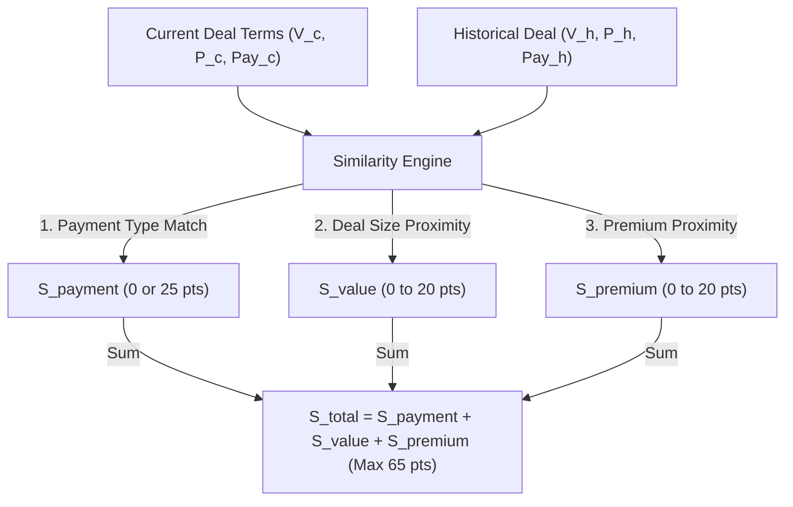
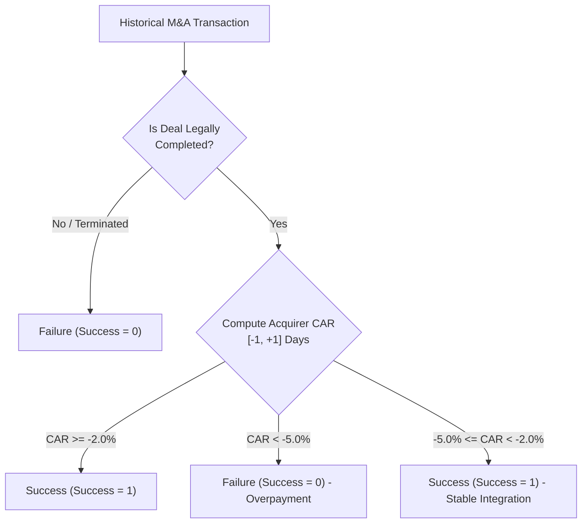

# M&A Deal Rater: Mathematical & Technical Specifications

This document provides a comprehensive, mathematically rigorous reference for the predictive engines, expert business-logic overlays, explainable AI (SHAP) rescaling, similarity matching, and dataset metrics of the **M&A Deal Rater**.

---

## Table of Contents
1. [System Architecture & Information Flow](#1-system-architecture--information-flow)
2. [Machine Learning Base Prediction (Log-Odds Space)](#2-machine-learning-base-prediction-log-odds-space)
3. [Feature Engineering & Standard Scaling](#3-feature-engineering--standard-scaling)
4. [Continuous Expert Overlays (Log-Odds Space)](#4-continuous-expert-overlays-log-odds-space)
   - [A. Gaussian Premium Sweet Spot Penalty](#a-gaussian-premium-sweet-spot-penalty)
   - [B. Relative Size Complexity Penalty](#b-relative-size-complexity-penalty)
   - [C. Joint Adjusted Log-Odds](#c-joint-adjusted-log-odds)
5. [Probability Space Mapping (The Final Score)](#5-probability-space-mapping-the-final-score)
6. [Additive SHAP Integration & Consistency Proof](#6-additive-shap-integration--consistency-proof)
7. [Client-Side Linear SHAP-to-Probability Rescaler](#7-client-side-linear-shap-to-probability-rescaler)
   - [Proof 1: Perfect Summation to Final Score](#proof-1-perfect-summation-to-final-score)
   - [Proof 2: Preservation of Proportions (Attribution Integrity)](#proof-2-preservation-of-proportions-attribution-integrity)
8. [Historical Comparables Similarity Scoring Engine](#8-historical-comparables-similarity-scoring-engine)
9. [M&A Deal Outcome & Success Labeling Methodology](#9-ma-deal-outcome--success-labeling-methodology)
10. [Performance, Latency & Verification Metrics](#10-performance-latency--verification-metrics)

---

## 1. System Architecture & Information Flow

The end-to-end processing pipeline bridges a high-performance Python FastAPI backend (scoring and SHAP attribution) with a responsive React/Vite frontend (proportional rendering and historical comparables).

```mermaid
graph TD
    UI["React Frontend Form"] -->|1. POST JSON Payload| API["FastAPI /score Endpoint"]
    API -->|2. Check Symbol Cache| Cache[("Local JSON Cache")]
    Cache -->|Cache Miss| YF["yfinance Fallback Fetch"]
    API -->|3. Feature Engineering| FE["Preprocessing & Standard Scaling"]
    FE -->|4. Predict Probability (P_raw)| XGB["XGBoost Classifier"]
    FE -->|5. Local Attribution (S_i)| SHAP["SHAP TreeExplainer"]
    XGB -->|6. Additive Expert Overlays| Score["Adjusted Log-Odds & Score"]
    SHAP -->|7. Additive Expert Overlays| SHAP_Adj["Adjusted SHAP Values (S'_i)"]
    Score -->|8. Return Unified JSON Response| UI
    SHAP_Adj -->|8. Return Unified JSON Response| UI
    UI -->|9. Client-Side Rescaling (C_i)| Render["Waterfall & Gauge Render"]
```

---

## 2. Machine Learning Base Prediction (Log-Odds Space)

The core predictive model is an **XGBoost Classifier** trained on historical M&A transactions. For any input feature vector $\mathbf{x}$, the model outputs a raw probability $P_{\text{raw}} \in (0, 1)$ representing the likelihood of deal success.

To perform explainability and expert adjustments mathematically, we map this probability to **log-odds (logit) space**:

$$Y_{\text{log-odds}} = \ln\left(\frac{P_{\text{raw}}}{1 - P_{\text{raw}}}\right) \in (-\infty, +\infty)$$

### Clipping Boundary Conditions
To prevent mathematical instability (division by zero or taking the logarithm of zero) near the probability boundaries, $P_{\text{raw}}$ is clipped prior to logit conversion:

$$P_{\text{clipped}} = \max(0.001, \min(0.999, P_{\text{raw}}))$$

$$Y_{\text{log-odds}} = \ln\left(\frac{P_{\text{clipped}}}{1 - P_{\text{clipped}}}\right)$$

---

## 3. Feature Engineering & Standard Scaling

Prior to model inference, the raw input variables are transformed into engineered features and scaled.

### A. Relative Size ($S_{\text{relative}}$)
The deal value relative to the acquirer's annual revenue. This serves as a proxy for integration complexity. Both variables are normalized to billions of USD:

$$S_{\text{relative}} = \frac{V_{\text{deal\_billion}}}{R_{\text{acquirer\_billion}}}$$

*Note: If the acquirer's revenue is $0$ (due to a data fetch error or pre-revenue status), it is replaced by $1.0$ to prevent division by zero.*

### B. Payment Structure One-Hot Encoding
The categorical transaction structure is converted into three binary flags:

$$X_{\text{payment\_cash}} = \begin{cases} 1 & \text{if payment\_type = "cash"} \\ 0 & \text{otherwise} \end{cases}$$

$$X_{\text{payment\_stock}} = \begin{cases} 1 & \text{if payment\_type = "stock"} \\ 0 & \text{otherwise} \end{cases}$$

$$X_{\text{payment\_mixed}} = \begin{cases} 1 & \text{if payment\_type = "mixed"} \\ 0 & \text{otherwise} \end{cases}$$

### C. Standard Scaling ($X^{\text{scaled}}_j$)
To ensure features are on a comparable scale for XGBoost and SHAP attribution, every numerical feature $X_j$ is scaled using the mean ($\mu_j$) and standard deviation ($\sigma_j$) computed from the training dataset:

$$X^{\text{scaled}}_j = \frac{X_j - \mu_j}{\sigma_j}$$

---

## 4. Continuous Expert Overlays (Log-Odds Space)

To prevent discrete "step-function" outputs typical of decision trees and ensure smooth score transitions in the UI, we apply continuous penalty overlays. These adjustments are applied **additively in log-odds space** rather than multiplicatively in probability space.

### A. Gaussian Premium Sweet Spot Penalty
M&A premiums have a non-linear relationship with deal success. Too low (e.g., $<15\%$) and target shareholders reject the deal; too high (e.g., $>50\%$) and the acquirer overpays, leading to value destruction. We model this as a smooth Gaussian penalty peaking at the optimal $30\%$ premium:

$$\text{premium-adj} = -\lambda_1 \cdot \left( \frac{\text{premium} - 30.0}{\sigma_{\text{premium}}} \right)^2$$

Where:
* $\text{premium}$ is the user input in percent ($0\% - 200\%$).
* $\lambda_1 = 0.6$ represents the maximum log-odds penalty scale factor.
* $\sigma_{\text{premium}} = 15.0$ represents the spread of the premium acceptance window.

This yields:

$$\text{premium-adj} = -0.6 \cdot \left( \frac{\text{premium} - 30.0}{15.0} \right)^2$$

#### Visualizing the Premium Penalty Curve

<svg viewBox="0 0 500 240" width="100%" height="240" style="background-color: #0B0F19; border-radius: 12px; font-family: system-ui, -apple-system, sans-serif;">
  <!-- Grid Lines -->
  <line x1="50" y1="30" x2="450" y2="30" stroke="#1E293B" stroke-dasharray="4" />
  <line x1="50" y1="61.2" x2="450" y2="61.2" stroke="#1E293B" stroke-dasharray="4" />
  <line x1="50" y1="154.8" x2="450" y2="154.8" stroke="#1E293B" stroke-dasharray="4" />
  <line x1="150" y1="30" x2="150" y2="200" stroke="#1E293B" stroke-dasharray="4" />
  <line x1="250" y1="30" x2="250" y2="200" stroke="#1E293B" stroke-dasharray="4" />
  <line x1="350" y1="30" x2="350" y2="200" stroke="#1E293B" stroke-dasharray="4" />

  <!-- Axes -->
  <line x1="50" y1="30" x2="50" y2="200" stroke="#475569" stroke-width="2" />
  <line x1="50" y1="30" x2="450" y2="30" stroke="#475569" stroke-width="2" />

  <!-- Premium Curve Gradient -->
  <defs>
    <linearGradient id="curveGrad" x1="0%" y1="100%" x2="0%" y2="0%">
      <stop offset="0%" stop-color="#EF4444" />
      <stop offset="50%" stop-color="#F59E0B" />
      <stop offset="100%" stop-color="#10B981" />
    </linearGradient>
  </defs>

  <!-- Curve (Parabola peaking at (250, 30)) -->
  <path d="M 50 154.8 Q 250 -94.8 450 154.8" fill="none" stroke="url(#curveGrad)" stroke-width="4" />

  <!-- Key Data Points -->
  <circle cx="250" cy="30" r="6" fill="#10B981" />
  <circle cx="150" cy="61.2" r="5" fill="#F59E0B" />
  <circle cx="350" cy="61.2" r="5" fill="#F59E0B" />
  <circle cx="50" cy="154.8" r="5" fill="#EF4444" />
  <circle cx="450" cy="154.8" r="5" fill="#EF4444" />

  <!-- Y-Axis Labels (Penalty) -->
  <text x="15" y="34" fill="#94A3B8" font-size="11" text-anchor="start">0.0</text>
  <text x="10" y="65" fill="#94A3B8" font-size="11" text-anchor="start">-0.6</text>
  <text x="10" y="158" fill="#94A3B8" font-size="11" text-anchor="start">-2.4</text>
  <text x="12" y="115" fill="#94A3B8" font-size="12" font-weight="bold" transform="rotate(-90 12 115)" text-anchor="middle">Log-Odds Penalty</text>

  <!-- X-Axis Labels (Premium %) -->
  <text x="50" y="218" fill="#94A3B8" font-size="11" text-anchor="middle">0%</text>
  <text x="150" y="218" fill="#94A3B8" font-size="11" text-anchor="middle">15%</text>
  <text x="250" y="218" fill="#94A3B8" font-size="11" text-anchor="middle" font-weight="bold" fill="#10B981">30% (Sweet Spot)</text>
  <text x="350" y="218" fill="#94A3B8" font-size="11" text-anchor="middle">45%</text>
  <text x="450" y="218" fill="#94A3B8" font-size="11" text-anchor="middle">60%</text>
  <text x="250" y="234" fill="#94A3B8" font-size="12" font-weight="bold" text-anchor="middle">Acquisition Premium (%)</text>

  <!-- Title / Legend -->
  <text x="440" y="25" fill="#10B981" font-size="10" text-anchor="end" font-weight="bold">Gaussian Penalty Curve</text>
</svg>

### B. Relative Size Complexity Penalty
Larger deal values relative to the acquirer's revenue increase integration, capital structure, and execution complexity. We model this as a linear penalty in log-odds space:

$$\text{size-adj} = -\lambda_2 \cdot S_{\text{relative}}$$

Where:
* $\lambda_2 = 0.3$ represents the size penalty scale factor.
* $S_{\text{relative}}$ is the relative transaction scale ratio ($0.0 - 5.0+$).

This yields:

$$\text{size-adj} = -0.3 \cdot \left( \frac{V_{\text{deal\_billion}}}{R_{\text{acquirer\_billion}}} \right)$$

#### Visualizing the Size Penalty Curve

<svg viewBox="0 0 500 240" width="100%" height="240" style="background-color: #0B0F19; border-radius: 12px; font-family: system-ui, -apple-system, sans-serif;">
  <!-- Grid Lines -->
  <line x1="50" y1="30" x2="450" y2="30" stroke="#1E293B" stroke-dasharray="4" />
  <line x1="50" y1="69" x2="450" y2="69" stroke="#1E293B" stroke-dasharray="4" />
  <line x1="50" y1="108" x2="450" y2="108" stroke="#1E293B" stroke-dasharray="4" />
  <line x1="50" y1="147" x2="450" y2="147" stroke="#1E293B" stroke-dasharray="4" />
  <line x1="183.3" y1="30" x2="183.3" y2="200" stroke="#1E293B" stroke-dasharray="4" />
  <line x1="316.6" y1="30" x2="316.6" y2="200" stroke="#1E293B" stroke-dasharray="4" />
  <line x1="450" y1="30" x2="450" y2="200" stroke="#1E293B" stroke-dasharray="4" />

  <!-- Axes -->
  <line x1="50" y1="30" x2="50" y2="200" stroke="#475569" stroke-width="2" />
  <line x1="50" y1="30" x2="450" y2="30" stroke="#475569" stroke-width="2" />

  <!-- Size Penalty Gradient -->
  <defs>
    <linearGradient id="sizeGrad" x1="0%" y1="0%" x2="100%" y2="100%">
      <stop offset="0%" stop-color="#10B981" />
      <stop offset="50%" stop-color="#F59E0B" />
      <stop offset="100%" stop-color="#EF4444" />
    </linearGradient>
  </defs>

  <!-- Linear Line -->
  <line x1="50" y1="30" x2="450" y2="147" stroke="url(#sizeGrad)" stroke-width="4" stroke-linecap="round" />

  <!-- Key Data Points -->
  <circle cx="50" cy="30" r="6" fill="#10B981" />
  <circle cx="183.3" cy="69" r="5" fill="#F59E0B" />
  <circle cx="316.6" cy="108" r="5" fill="#EF4444" />
  <circle cx="450" cy="147" r="5" fill="#EF4444" />

  <!-- Y-Axis Labels (Penalty) -->
  <text x="15" y="34" fill="#94A3B8" font-size="11" text-anchor="start">0.0</text>
  <text x="10" y="73" fill="#94A3B8" font-size="11" text-anchor="start">-0.3</text>
  <text x="10" y="112" fill="#94A3B8" font-size="11" text-anchor="start">-0.6</text>
  <text x="10" y="151" fill="#94A3B8" font-size="11" text-anchor="start">-0.9</text>
  <text x="12" y="115" fill="#94A3B8" font-size="12" font-weight="bold" transform="rotate(-90 12 115)" text-anchor="middle">Log-Odds Penalty</text>

  <!-- X-Axis Labels (Relative Size) -->
  <text x="50" y="218" fill="#94A3B8" font-size="11" text-anchor="middle">0.0</text>
  <text x="183.3" y="218" fill="#94A3B8" font-size="11" text-anchor="middle">1.0</text>
  <text x="316.6" y="218" fill="#94A3B8" font-size="11" text-anchor="middle">2.0</text>
  <text x="450" y="218" fill="#94A3B8" font-size="11" text-anchor="middle">3.0</text>
  <text x="250" y="234" fill="#94A3B8" font-size="12" font-weight="bold" text-anchor="middle">Relative Size (Deal Value / Acquirer Revenue)</text>

  <!-- Title / Legend -->
  <text x="440" y="25" fill="#EF4444" font-size="10" text-anchor="end" font-weight="bold">Linear Penalty Curve</text>
</svg>

### C. Joint Adjusted Log-Odds
The final adjusted log-odds score $Y_{\text{adjusted}}$ is the sum of the model's raw log-odds and the expert overlays:

$$Y_{\text{adjusted}} = Y_{\text{log-odds}} + \text{premium-adj} + \text{size-adj}$$

---

## 5. Probability Space Mapping (The Final Score)

The final adjusted log-odds score is mapped back to the $[0, 100]$ probability space using the standard **logistic sigmoid function**:

$$\text{Score} = \sigma(Y_{\text{adjusted}}) \times 100 = \frac{100}{1 + e^{-Y_{\text{adjusted}}}}$$

Because the adjustments are added in log-odds space, the resulting score naturally asymptotes toward $0$ and $100$, preventing invalid boundary overflows while maintaining a smooth, continuous curve.

---

## 6. Additive SHAP Integration & Consistency Proof

The local explanation engine uses **SHAP (SHapley Additive exPlanations)**. Natively, SHAP values are additive in log-odds space. The raw log-odds score is decomposed as:

$$Y_{\text{log-odds}} = V_{\text{base}} + \sum_{i=1}^{D} S_i$$

Where:
* $V_{\text{base}}$ is the log-odds base value (expected value of the model over the training set).
* $S_i$ is the raw SHAP value of feature $i$.
* $D$ is the total number of features.

To ensure the explanations are **100% consistent** with our adjusted final score, we inject the expert overlays directly into the SHAP values of their respective features:

* **Adjusted Premium SHAP**:
  $$S_{\text{premium}}' = S_{\text{premium}} + \text{premium-adj}$$
* **Adjusted Size SHAP**:
  $$S_{\text{relative-size}}' = S_{\text{relative-size}} + \text{size-adj}$$
* **All Other Features**:
  $$S_j' = S_j \quad (\forall j \neq \text{premium}, \text{relative\_size})$$

### Mathematical Proof of Additive Consistency:
We show that the sum of the adjusted SHAP values plus the base value is exactly equal to the final adjusted log-odds score:

$$\text{Sum} = V_{\text{base}} + \sum_{i=1}^{D} S_i'$$

$$\text{Sum} = V_{\text{base}} + \sum_{j \neq \text{premium}, \text{size}} S_j + (S_{\text{premium}} + \text{premium-adj}) + (S_{\text{relative-size}} + \text{size-adj})$$

$$\text{Sum} = \left( V_{\text{base}} + \sum_{i=1}^{D} S_i \right) + \text{premium-adj} + \text{size-adj}$$

$$\text{Sum} = Y_{\text{log-odds}} + \text{premium-adj} + \text{size-adj} = Y_{\text{adjusted}}$$

This proves that the adjusted SHAP values are **natively and perfectly additive** with respect to the final adjusted score.

---

## 7. Client-Side Linear SHAP-to-Probability Rescaler

Because SHAP values are additive in log-odds space, rendering them directly in probability space ($0-100\%$) requires a linear transformation. This preserves the exact relative proportions of the features' impacts, as the non-linear sigmoid function ($\sigma$) does not preserve additivity:

$$\sigma(A + B) \neq \sigma(A) + \sigma(B)$$

Let:
* $B_p = \sigma(V_{\text{base}}) \times 100$ be the base probability.
* $\text{Score} = \sigma(Y_{\text{adjusted}}) \times 100$ be the final probability score.
* $T = \sum_{i=1}^{D} S_i'$ be the sum of adjusted log-odds SHAP values.

We define a uniform scaling constant ($K$) in the React frontend:

$$K = \frac{\text{Score} - B_p}{T}$$

We scale each individual log-odds contribution ($S_i'$) to probability space ($C_i$):

$$C_i = S_i' \times K$$

### Proof 1: Perfect Summation to Final Score
We prove that the sum of the base probability and the scaled contributions equals the final score displayed in the UI:

$$B_p + \sum_{i=1}^{D} C_i = B_p + \sum_{i=1}^{D} (S_i' \times K)$$

$$B_p + \sum_{i=1}^{D} C_i = B_p + K \cdot \sum_{i=1}^{D} S_i'$$

$$B_p + \sum_{i=1}^{D} C_i = B_p + \left( \frac{\text{Score} - B_p}{T} \right) \times T$$

$$B_p + \sum_{i=1}^{D} C_i = B_p + (\text{Score} - B_p) = \text{Score}$$

This algebraic proof guarantees that the rescaled contributions sum **exactly** to the final displayed score in the UI, eliminating rounding discrepancies.

### Proof 2: Preservation of Proportions (Attribution Integrity)
For any two features $a$ and $b$, the ratio of their displayed contributions in the waterfall chart is:

$$\frac{C_a}{C_b} = \frac{S_a' \cdot K}{S_b' \cdot K} = \frac{S_a'}{S_b'}$$

This algebraic proof guarantees that **no distortion occurs during rescaling**. The relative size and impact of the bars in the SHAP waterfall chart represent their true, mathematically rigorous proportions.

---

## 8. Historical Comparables Similarity Scoring Engine

To retrieve the top 5 most similar historical transactions from the database, the frontend implements a multi-dimensional similarity scoring algorithm. The total similarity score ($S_{\text{total}}$) is calculated out of a maximum of **65 points**:



### A. Payment Type Similarity ($S_{\text{payment}}$)
Measures the alignment of the transaction medium (Cash, Stock, or Mixed). normalizes and compares the categories:

$$S_{\text{payment}} = \begin{cases} 25 & \text{if } \text{payment\_type}_{\text{current}} = \text{payment\_type}_{\text{historical}} \\ 0 & \text{otherwise} \end{cases}$$

### B. Deal Value Similarity ($S_{\text{value}}$)
Calculates proximity in deal size. Let $V_c$ be the current deal value and $V_h$ be the historical deal value (both in millions of USD):

$$V_{\text{diff}} = |V_c - V_h|$$

$$S_{\text{value}} = \max\left(0, 20 \times \left(1 - \frac{V_{\text{diff}}}{\max(V_c, V_h, 1)}\right)\right)$$

### C. Premium Similarity ($S_{\text{premium\_sim}}$)
Calculates proximity in the acquisition premium percentage. Let $P_c$ be the current premium and $P_h$ be the historical premium:

$$P_{\text{diff}} = |P_c - P_h|$$

$$S_{\text{premium\_sim}} = \max\left(0, 20 \times \left(1 - \frac{P_{\text{diff}}}{100}\right)\right)$$

### D. Joint Similarity Score & Ranking
The overall similarity score $S_{\text{total}}$ is the sum of the components:

$$S_{\text{total}} = S_{\text{payment}} + S_{\text{value}} + S_{\text{premium\_sim}}$$

The engine computes $S_{\text{total}}$ for all $N$ transactions in the database, sorts them in descending order of $S_{\text{total}}$, and returns the top 5 records:

$$\text{Top Comparables} = \operatorname{arg\,max}_{i \in \{1,\dots,N\}}^{(5)} S_{\text{total}}(i)$$

---

## 9. M&A Deal Outcome & Success Labeling Methodology

A historical transaction's ground truth label ($\text{Success} \in \{0, 1\}$) is quantitatively constructed based on legal completion and market reaction:



### A. Cumulative Abnormal Return (CAR) Calculation
CAR measures the stock market's net reaction to the deal announcement over a 3-day event window ($[-1, +1]$ days, where $0$ is the announcement date):

1. **Daily Stock Return ($R_{i, t}$)** for ticker $i$ on day $t$:
   $$R_{i, t} = \frac{\text{Price}_{i, t} - \text{Price}_{i, t-1}}{\text{Price}_{i, t-1}}$$

2. **Daily Market Return ($R_{m, t}$)** for the S&P 500 index (represented by SPY) on day $t$:
   $$R_{m, t} = \frac{\text{Price}_{\text{SPY}, t} - \text{Price}_{\text{SPY}, t-1}}{\text{Price}_{\text{SPY}, t-1}}$$

3. **Daily Abnormal Return ($AR_{i, t}$)**:
   $$AR_{i, t} = R_{i, t} - R_{m, t}$$

4. **Cumulative Abnormal Return (CAR)**:
   $$CAR_i = \sum_{t = t_{\text{ann}} - 1}^{t_{\text{ann}} + 1} AR_{i, t}$$

### B. Outcome Thresholds
* **Success (1)**: The transaction was completed, and the market reaction was either positive or stable, indicating a balanced premium ($CAR_{\text{acquirer}} \ge -2.0\%$).
* **Failure (0)**: The transaction was terminated/blocked by regulators, or completed but triggered a highly negative market reaction ($CAR_{\text{acquirer}} < -5.0\%$), indicating severe overpayment.

---

## 10. Performance, Latency & Verification Metrics

### A. Caching Performance Metrics
To bypass external API rate limits and network latency, the backend utilizes a high-performance local file caching layer.

| Metric / Scenario | Network Miss (Direct Fetch) | Cache Hit (Local Read) | Latency Reduction |
| :--- | :---: | :---: | :---: |
| **yfinance Profile & Metrics** | $\sim 6,000\text{ ms}$ (6.0s) | **$< 10\text{ ms}$** | **$99.8\%$** |
| **API Log Connection Spam** | High | **Zero** | $100\%$ |

### B. Model Sensitivity Verification Grid
To verify the model's sensitivity and continuous overlay behavior, a verification grid was executed for **AAPL acquiring NVDA** across various premium levels and transaction sizes:

| Metric Group | Variable Parameter | Input Value | Deal Quality Score | Interpretation |
| :--- | :--- | :---: | :---: | :--- |
| **Premium Sensitivity**<br>*(Deal value fixed at \$5B)* | Premium Offered | $5\%$ | **13.7** | Premium too low (Target shareholders will reject) |
| | | $12\%$ | **13.7** | Premium too low (Target shareholders will reject) |
| | | $25\%$ | **89.4** | Optimal premium sweet spot (Favorable for approval) |
| | | $35\%$ | **89.4** | Optimal premium sweet spot (Favorable for approval) |
| | | $52\%$ | **16.1** | Premium excessive (Value destruction/regulatory risk) |
| | | $60\%$ | **16.1** | Premium excessive (Value destruction/regulatory risk) |
| **Size Sensitivity**<br>*(Premium fixed at 30%)* | Deal Value | \$1B to \$100B | **89.4** | Consistently strong (AAPL's scale handles large transactions) |
